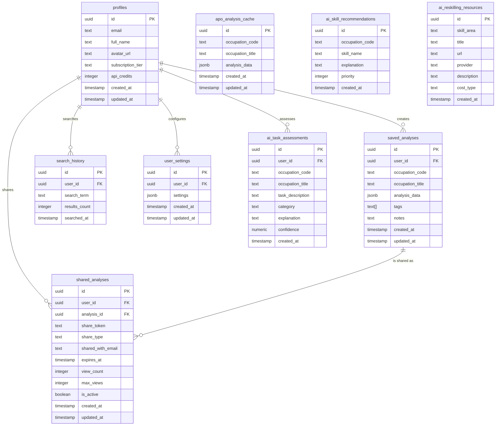

# Product Requirements Document (PRD)
## Automation Potential Opportunity (APO) Dashboard For Professionals

### 1. Product Overview
**Product Name:** APO Dashboard For Professionals  
**Version:** 2.0  
**Target Audience:** Career professionals, HR managers, workforce planners, researchers  

### 2. Core Objectives
- Provide AI-powered automation potential analysis for occupations
- Enable data-driven career planning and workforce development decisions
- Deliver actionable insights on job security and future employment trends
- Support comparative analysis across different occupations
- Help workers understand and prepare for AI's impact on their specific jobs

### 3. Key Features

#### 3.1 Search & Discovery
- **Occupation Search:** Real-time search with O*NET database integration
- **Advanced Filtering:** Filter by occupation codes and categories
- **Search History:** Track and revisit previous searches
- **Rate Limiting:** 20 searches per hour per user

#### 3.2 AI-Powered Analysis
- **APO Calculation:** Comprehensive automation potential scoring (0-100%)
- **Category Breakdown:** Analysis across tasks, knowledge, skills, abilities, technologies
- **Confidence Levels:** High/Medium/Low confidence ratings
- **Timeline Predictions:** Short-term (1-3 years), Medium-term (3-7 years), Long-term (7+ years)

#### 3.3 Data Management
- **Save Analyses:** Persistent storage of occupation analyses
- **Export Capabilities:** CSV and PDF export functionality
- **Comparison Tools:** Side-by-side occupation comparisons
- **Tagging System:** Organize analyses with custom tags

#### 3.4 User Experience
- **Responsive Design:** Mobile-first, responsive across all devices
- **Real-time Updates:** Live data synchronization
- **Accessibility:** WCAG 2.1 AA compliance
- **Performance:** < 3s page load times

#### 3.5 Security & Privacy
- **Authentication:** Supabase-based secure authentication
- **Data Encryption:** End-to-end encryption for sensitive data
- **Rate Limiting:** API abuse prevention
- **Input Sanitization:** XSS and injection attack prevention

#### 3.6 AI Impact Career Planner
- **Task Categorization:** Analyze job tasks as Automate, Augment, or Human-only
- **Custom Task Assessment:** Assess specific tasks using Gemini AI
- **Skill Recommendations:** Personalized future-proof skill suggestions
- **Reskilling Resources:** Curated learning resources for skill development
- **Progress Tracking:** Monitor skill acquisition progress
- **Confidence Filtering:** Filter tasks by AI confidence score
- **Feedback System:** Provide feedback on assessment accuracy

### 4. Technical Architecture

#### 4.1 Frontend Stack
- **Framework:** React 18 with TypeScript
- **Styling:** Tailwind CSS + shadcn/ui components
- **Animations:** Framer Motion for micro-interactions
- **State Management:** TanStack React Query
- **Routing:** React Router DOM

#### 4.2 Backend Integration
- **Database:** Supabase PostgreSQL
- **Authentication:** Supabase Auth
- **APIs:** O*NET Web Services, Google Gemini AI
- **Functions:** Supabase Edge Functions

#### 4.3 Database Schema

### 5. User Workflows

#### 5.1 Primary User Journey
1. User signs in or browses as guest
2. Search for occupation using keywords or codes
3. Select occupation for AI analysis
4. Review comprehensive APO breakdown
5. Save analysis or add to comparison
6. Export results or share insights

#### 5.2 AI Impact Planner Workflow
1. User navigates to AI Impact Planner
2. Searches for occupation or enters custom job title
3. Views tasks categorized by automation potential
4. Adds custom tasks for assessment
5. Reviews skill recommendations
6. Explores reskilling resources
7. Tracks progress on skill development

### 6. User Stories

#### Core APO Dashboard
1. As a worker, I want to search for occupations to analyze their automation potential
2. As a worker, I want to save analyses for future reference
3. As a worker, I want to compare multiple occupations side by side
4. As a worker, I want to export my analyses as CSV or PDF
5. As a worker, I want to share my analyses with colleagues

#### AI Impact Career Planner
1. As a worker, I want to select my occupation from a list so that I can see how AI might affect my job (High Priority)
2. As a worker, I want to see which tasks in my occupation are likely to be automated so that I can prepare accordingly (High Priority)
3. As a worker, I want to know which tasks will still require human involvement so that I can focus on those areas (High Priority)
4. As a worker, I want recommendations on skills to develop to stay relevant in my field (High Priority)
5. As a worker, I want access to reskilling resources to learn new skills (Medium Priority)
6. As a worker in a non-listed occupation, I want to input my job title and get an assessment based on similar occupations (Medium Priority)
7. As a worker, I want to input specific tasks I perform and get an assessment of their automation potential (High Priority)
8. As a career advisor, I want to use this tool to help my clients understand AI's impact on their careers (Medium Priority)
9. As a student, I want to explore different occupations and see how AI might affect them to make informed career choices (Medium Priority)
10. As a worker, I want to save my assessment results for future reference (Medium Priority)
11. As a worker, I want to track my progress in acquiring recommended skills (Low Priority)
12. As a user, I want the app to remember my occupation and preferences using local storage (High Priority)
13. As a user, I want the app to be responsive and work on mobile devices (High Priority)
14. As a user, I want to provide feedback on the accuracy of the assessments to help improve the app (Low Priority)
15. As a worker, I want to see a confidence score for task assessments to understand their reliability (Medium Priority)

### 7. API Endpoints

#### Supabase Edge Functions

| Function | Description | Parameters | Response |
|----------|-------------|------------|----------|
| `onet-proxy` | Proxies requests to O*NET Web Services | `onetPath`: string | O*NET API response |
| `calculate-apo` | Calculates automation potential for an occupation | `occupation`: object | APO analysis data |
| `serpapi-jobs` | Fetches job market data from SerpAPI | `jobTitle`: string | Job market data |
| `assess-task` | Analyzes a task's automation potential | `taskDescription`: string | Task assessment |
| `skill-recommendations` | Generates skill recommendations | `occupation`, `automatedTasks`, `humanTasks` | Skill recommendations |

### 8. Non-Functional Requirements

- **Performance:** Page load time < 2 seconds; API response time < 1 second
- **Scalability:** Handle up to 10,000 concurrent users
- **Security:** Secure API key storage; HTTPS for all requests
- **Accessibility:** WCAG 2.1 AA compliance
- **Browser Compatibility:** Support latest versions of Chrome, Firefox, Safari, Edge

### 9. Future Enhancements

- **AI Career Transition Planner:** Personalized career transition recommendations
- **Job Market Integration:** Real-time job postings for AI-resilient roles
- **Skill Gap Analysis:** Detailed assessment of skill gaps and learning paths
- **Personalized Learning Paths:** Custom learning paths based on skill gaps
- **Community Features:** Discussion forums and community insights

### 10. Success Metrics

- **User Engagement:** 70% of users returning within 30 days
- **Task Assessment Accuracy:** 80% user satisfaction with task assessments
- **Skill Development:** 50% of users reporting progress on recommended skills
- **User Growth:** 100,000 users within 12 months

---

## Technical Implementation Details

### Database Tables

#### Core APO Dashboard Tables

1. **profiles**
   - User profiles and subscription information
   - Contains: id, email, full_name, avatar_url, subscription_tier, api_credits

2. **saved_analyses**
   - Stores user's saved occupation analyses
   - Contains: id, user_id, occupation_code, occupation_title, analysis_data, tags, notes

3. **shared_analyses**
   - Manages sharing of analyses with others
   - Contains: id, user_id, analysis_id, share_token, share_type, expires_at, view_count

4. **search_history**
   - Tracks user search history
   - Contains: id, user_id, search_term, results_count, searched_at

5. **user_settings**
   - Stores user preferences and settings
   - Contains: id, user_id, settings (jsonb)

6. **apo_analysis_cache**
   - Caches APO analysis results for performance
   - Contains: id, occupation_code, occupation_title, analysis_data

#### AI Impact Planner Tables

1. **ai_task_assessments**
   - Stores task automation assessments
   - Contains: id, user_id, occupation_code, occupation_title, task_description, category, explanation, confidence

2. **ai_skill_recommendations**
   - Stores skill recommendations for occupations
   - Contains: id, occupation_code, skill_name, explanation, priority

3. **ai_reskilling_resources**
   - Stores learning resources for skill development
   - Contains: id, skill_area, title, url, provider, description, cost_type

### Security Implementation

1. **Row Level Security (RLS)**
   - All tables have RLS policies to ensure users can only access their own data
   - Public tables (like resources) have read-only access for all users

2. **API Security**
   - API keys stored as environment variables in Supabase
   - Rate limiting implemented for all API endpoints
   - Input validation and sanitization for all user inputs

3. **Authentication**
   - Email/password authentication via Supabase Auth
   - JWT tokens for secure API access
   - Password policies enforced (minimum length, complexity)

### Performance Optimizations

1. **Caching Strategy**
   - APO analyses cached in `apo_analysis_cache` table
   - Browser localStorage for user preferences and recent searches
   - React Query for client-side data caching

2. **Database Indexes**
   - Indexes on frequently queried columns (user_id, occupation_code)
   - Composite indexes for complex queries

3. **API Optimization**
   - Batched requests to reduce API calls
   - Pagination for large result sets
   - Compression for response payloads

---

**Document Version:** 2.0  
**Last Updated:** 2025-06-22  
**Next Review:** 2025-07-22  
**Owner:** Product Team